# Database Schema - Vilo Platform

**Auto-generated documentation**
**Generated**: 2026-01-16
**Total Tables**: 84
**Total Relationships**: 133

---

## Table of Contents

- [add_ons](#add_ons)
- [audit_log](#audit_log)
- [billing_statuses](#billing_statuses)
- [booking_addons](#booking_addons)
- [booking_guests](#booking_guests)
- [booking_payment_schedules](#booking_payment_schedules)
- [booking_payments](#booking_payments)
- [booking_rooms](#booking_rooms)
- [booking_status_history](#booking_status_history)
- [bookings](#bookings)
- [cancellation_policies](#cancellation_policies)
- [chat_attachments](#chat_attachments)
- [chat_conversations](#chat_conversations)
- [chat_messages](#chat_messages)
- [chat_participants](#chat_participants)
- [chat_reactions](#chat_reactions)
- [chat_typing_indicators](#chat_typing_indicators)
- [checkouts](#checkouts)
- [cities](#cities)
- [companies](#companies)
- [company_payment_integrations](#company_payment_integrations)
- [company_team_members](#company_team_members)
- [company_whatsapp_config](#company_whatsapp_config)
- [countries](#countries)
- [credit_memos](#credit_memos)
- [credit_notes](#credit_notes)
- [customer_properties](#customer_properties)
- [customers](#customers)
- [invoice_settings](#invoice_settings)
- [invoices](#invoices)
- [lead_activities](#lead_activities)
- [leads](#leads)
- [notification_preferences](#notification_preferences)
- [notification_templates](#notification_templates)
- [notification_types](#notification_types)
- [notifications](#notifications)
- [payment_integrations](#payment_integrations)
- [permission_templates](#permission_templates)
- [permissions](#permissions)
- [pipeline_stages](#pipeline_stages)
- [properties](#properties)
- [property_reviews](#property_reviews)
- [property_websites](#property_websites)
- [provinces](#provinces)
- [refund_comments](#refund_comments)
- [refund_documents](#refund_documents)
- [refund_requests](#refund_requests)
- [refund_status_history](#refund_status_history)
- [role_permissions](#role_permissions)
- [roles](#roles)
- [room_addon_assignments](#room_addon_assignments)
- [room_availability_blocks](#room_availability_blocks)
- [room_beds](#room_beds)
- [room_payment_rule_assignments](#room_payment_rule_assignments)
- [room_payment_rules](#room_payment_rules)
- [room_promotion_assignments](#room_promotion_assignments)
- [room_promotions](#room_promotions)
- [room_seasonal_rates](#room_seasonal_rates)
- [rooms](#rooms)
- [subscription_limits](#subscription_limits)
- [subscription_type_permissions](#subscription_type_permissions)
- [subscription_types](#subscription_types)
- [support_canned_responses](#support_canned_responses)
- [support_internal_notes](#support_internal_notes)
- [support_tickets](#support_tickets)
- [template_categories](#template_categories)
- [template_data_bindings](#template_data_bindings)
- [template_sections](#template_sections)
- [user_permissions](#user_permissions)
- [user_properties](#user_properties)
- [user_roles](#user_roles)
- [user_sessions](#user_sessions)
- [user_subscriptions](#user_subscriptions)
- [user_type_permissions](#user_type_permissions)
- [user_types](#user_types)
- [user_wishlists](#user_wishlists)
- [users](#users)
- [website_analytics_events](#website_analytics_events)
- [website_templates](#website_templates)
- [whatsapp_message_metadata](#whatsapp_message_metadata)
- [whatsapp_message_queue](#whatsapp_message_queue)
- [whatsapp_message_templates](#whatsapp_message_templates)
- [whatsapp_opt_outs](#whatsapp_opt_outs)
- [whatsapp_phone_company_mapping](#whatsapp_phone_company_mapping)

---

## Entity Relationship Diagram

```mermaid
erDiagram
    role_permissions ||--o{ public : "has"
    users ||--o{ auth : "has"
    user_roles ||--o{ public : "has"
    user_roles ||--o{ auth : "has"
    user_permissions ||--o{ public : "has"
    user_permissions ||--o{ auth : "has"
    user_properties ||--o{ public : "has"
    user_properties ||--o{ auth : "has"
    audit_log ||--o{ auth : "has"
    audit_log ||--o{ public : "has"
    user_sessions ||--o{ public : "has"
    subscription_limits ||--o{ public : "has"
    user_subscriptions ||--o{ public : "has"
    notification_templates ||--o{ notification_types : "has"
    notifications ||--o{ users : "has"
    notifications ||--o{ notification_types : "has"
    notifications ||--o{ notification_templates : "has"
    notification_preferences ||--o{ users : "has"
    notification_preferences ||--o{ notification_templates : "has"
    companies ||--o{ public : "has"
    provinces ||--o{ countries : "has"
    cities ||--o{ provinces : "has"
    user_type_permissions ||--o{ public : "has"
    checkouts ||--o{ users : "has"
    checkouts ||--o{ subscription_types : "has"
    invoices ||--o{ public : "has"
    chat_participants ||--o{ chat_conversations : "has"
    chat_participants ||--o{ users : "has"
    chat_messages ||--o{ chat_conversations : "has"
    chat_messages ||--o{ users : "has"
    chat_attachments ||--o{ chat_messages : "has"
    chat_reactions ||--o{ chat_messages : "has"
    chat_reactions ||--o{ users : "has"
    chat_typing_indicators ||--o{ chat_conversations : "has"
    chat_typing_indicators ||--o{ users : "has"
    rooms ||--o{ public : "has"
    room_beds ||--o{ public : "has"
    room_seasonal_rates ||--o{ public : "has"
    room_promotions ||--o{ public : "has"
    add_ons ||--o{ public : "has"
    room_availability_blocks ||--o{ public : "has"
    bookings ||--o{ public : "has"
    booking_rooms ||--o{ public : "has"
    booking_addons ||--o{ public : "has"
    booking_guests ||--o{ public : "has"
    booking_status_history ||--o{ public : "has"
    booking_payments ||--o{ public : "has"
    refund_requests ||--o{ public : "has"
    room_payment_rules ||--o{ public : "has"
    booking_payment_schedules ||--o{ public : "has"
    room_payment_rule_assignments ||--o{ public : "has"
    room_addon_assignments ||--o{ public : "has"
    room_promotion_assignments ||--o{ public : "has"
    credit_memos ||--o{ public : "has"
    credit_notes ||--o{ public : "has"
    refund_comments ||--o{ refund_requests : "has"
    refund_comments ||--o{ users : "has"
    refund_status_history ||--o{ refund_requests : "has"
    refund_status_history ||--o{ users : "has"
    refund_documents ||--o{ refund_requests : "has"
    refund_documents ||--o{ users : "has"
    property_reviews ||--o{ properties : "has"
    property_reviews ||--o{ users : "has"
    website_templates ||--o{ public : "has"
    property_websites ||--o{ public : "has"
    template_sections ||--o{ public : "has"
    template_data_bindings ||--o{ public : "has"
    leads ||--o{ public : "has"
    lead_activities ||--o{ public : "has"
    user_wishlists ||--o{ auth : "has"
    user_wishlists ||--o{ properties : "has"
    subscription_type_permissions ||--o{ public : "has"
    company_team_members ||--o{ public : "has"
    company_payment_integrations ||--o{ public : "has"
    customers ||--o{ properties : "has"
    customers ||--o{ bookings : "has"
    customer_properties ||--o{ customers : "has"
    customer_properties ||--o{ properties : "has"
    whatsapp_message_templates ||--o{ properties : "has"
    whatsapp_message_metadata ||--o{ chat_messages : "has"
    whatsapp_message_queue ||--o{ chat_messages : "has"
    whatsapp_message_queue ||--o{ whatsapp_message_metadata : "has"
    support_tickets ||--o{ chat_conversations : "has"
    support_tickets ||--o{ companies : "has"
    support_tickets ||--o{ users : "has"
    support_internal_notes ||--o{ support_tickets : "has"
    company_whatsapp_config ||--o{ public : "has"
```

---

## Table Details

### add_ons

**Migration**: 032

| Column | Type | Nullable | Default | Notes |
|--------|------|----------|---------|-------|
| id | UUID | Yes | gen_random_uuid() | PK |
| property_id | UUID | No | - | FK → public |
| description | TEXT | Yes | - | - |
| pricing_type | addon_pricing_type | No | - | - |
| currency | VARCHAR(3) | No | - | - |
| updated_at | TIMESTAMPTZ | Yes | NOW() | - |
| id | UUID | Yes | gen_random_uuid() | PK |
| property_id | UUID | No | - | FK → public |
| description | TEXT | Yes | - | - |
| pricing_type | addon_pricing_type | No | - | - |
| currency | VARCHAR(3) | No | - | - |
| updated_at | TIMESTAMPTZ | Yes | NOW() | - |
| type | addon_type NOT NULL DEFAULT | Yes | - | - |
| max_quantity | INTEGER NOT NULL DEFAULT 1 | Yes | - | - |

**Indexes**:
- `idx_addons_property`
- `idx_addons_active`
- `idx_addons_sort`
- `idx_addons_type`
- `idx_addons_property_type_active`

---

### audit_log

**Migration**: 001

| Column | Type | Nullable | Default | Notes |
|--------|------|----------|---------|-------|
| id | UUID | Yes | uuid_generate_v4() | PK |
| actor_id | UUID | Yes | - | FK → auth |
| action | VARCHAR(100) | No | - | - |
| entity_type | VARCHAR(100) | No | - | - |
| entity_id | UUID | No | - | - |
| property_id | UUID | Yes | - | FK → public |
| old_data | JSONB | Yes | - | - |
| new_data | JSONB | Yes | - | - |
| metadata | JSONB | Yes | - | - |
| ip_address | INET | Yes | - | - |
| user_agent | TEXT | Yes | - | - |
| created_at | TIMESTAMPTZ | No | NOW() | - |

**Indexes**:
- `idx_audit_log_actor_id`
- `idx_audit_log_entity`
- `idx_audit_log_action`
- `idx_audit_log_property_id`
- `idx_audit_log_created_at`
- `idx_audit_created_at`
- `idx_audit_actor_id`
- `idx_audit_action`

---

### billing_statuses

**Migration**: 009

| Column | Type | Nullable | Default | Notes |
|--------|------|----------|---------|-------|
| id | UUID | Yes | gen_random_uuid() | PK |
| name | VARCHAR(50) | No | - | - |
| display_name | VARCHAR(100) | No | - | - |
| description | TEXT | Yes | - | - |
| is_system_status | BOOLEAN | Yes | false | - |
| color | VARCHAR(20) | Yes | - | - |
| feature_access_level | INTEGER | Yes | 0 | - |
| sort_order | INTEGER | Yes | 0 | - |
| created_at | TIMESTAMPTZ | Yes | NOW() | - |
| updated_at | TIMESTAMPTZ | Yes | NOW() | - |

**Indexes**:
- `idx_billing_statuses_sort`
- `idx_billing_statuses_name`

---

### booking_addons

**Migration**: 033

| Column | Type | Nullable | Default | Notes |
|--------|------|----------|---------|-------|
| id | UUID | Yes | gen_random_uuid() | PK |
| booking_id | UUID | No | - | FK → public |
| addon_id | UUID | No | - | FK → public |
| pricing_type | addon_pricing_type | No | - | - |
| unit_price | DECIMAL(12 | Yes | - | - |
| currency | VARCHAR(3) | No | - | - |
| updated_at | TIMESTAMPTZ | Yes | NOW() | - |

**Indexes**:
- `idx_booking_addons_booking`
- `idx_booking_addons_addon`

---

### booking_guests

**Migration**: 033

| Column | Type | Nullable | Default | Notes |
|--------|------|----------|---------|-------|
| id | UUID | Yes | gen_random_uuid() | PK |
| booking_id | UUID | No | - | FK → public |
| email | VARCHAR(255) | Yes | - | - |
| phone | VARCHAR(50) | Yes | - | - |
| is_adult | BOOLEAN | Yes | true | - |
| age | INTEGER | Yes | - | - |
| id_number | VARCHAR(100) | Yes | - | - |
| nationality | VARCHAR(100) | Yes | - | - |
| updated_at | TIMESTAMPTZ | Yes | NOW() | - |

**Indexes**:
- `idx_booking_guests_booking`
- `idx_booking_guests_email`

---

### booking_payment_schedules

**Migration**: 036

| Column | Type | Nullable | Default | Notes |
|--------|------|----------|---------|-------|
| id | UUID | Yes | gen_random_uuid() | PK |
| booking_id | UUID | No | - | FK → public |
| amount_paid | DECIMAL(12 | Yes | - | - |
| updated_at | TIMESTAMPTZ | No | NOW() | - |

**Indexes**:
- `idx_booking_payment_schedules_booking_id`
- `idx_booking_payment_schedules_status`
- `idx_booking_payment_schedules_due_date`
- `idx_booking_payment_schedules_pending`

---

### booking_payments

**Migration**: 033

| Column | Type | Nullable | Default | Notes |
|--------|------|----------|---------|-------|
| id | UUID | Yes | gen_random_uuid() | PK |
| booking_id | UUID | No | - | FK → public |
| currency | VARCHAR(3) | No | - | - |
| payment_method | payment_method | No | - | - |
| gateway_response | JSONB | Yes | - | - |
| paid_at | TIMESTAMPTZ | Yes | - | - |
| proof_verified_by | UUID | Yes | - | FK → public |
| proof_verified_at | TIMESTAMPTZ | Yes | - | - |
| updated_at | TIMESTAMPTZ | Yes | NOW() | - |
| created_by | UUID | Yes | - | FK → public |
| receipt_number | VARCHAR(50) | Yes | - | - |
| receipt_url | TEXT | Yes | - | - |
| applied_to_milestone_id | UUID REFERENCES public | Yes | - | - |
| payment_reference | VARCHAR(255) | Yes | - | - |
| proof_url | TEXT | Yes | - | - |
| proof_verified_by | UUID | Yes | - | - |
| proof_verified_at | TIMESTAMPTZ | Yes | - | - |

**Indexes**:
- `idx_booking_payments_booking`
- `idx_booking_payments_status`
- `idx_booking_payments_gateway`
- `idx_booking_payments_receipt_number`
- `idx_booking_payments_milestone`
- `idx_booking_payments_payment_reference`

---

### booking_rooms

**Migration**: 033

| Column | Type | Nullable | Default | Notes |
|--------|------|----------|---------|-------|
| id | UUID | Yes | gen_random_uuid() | PK |
| booking_id | UUID | No | - | FK → public |
| room_id | UUID | No | - | FK → public |
| room_code | VARCHAR(20) | Yes | - | - |
| children | INTEGER | No | 0 | - |
| children_ages | JSONB | Yes | - | - |
| nightly_rates | JSONB | No | - | - |
| room_subtotal | DECIMAL(12 | Yes | - | - |
| currency | VARCHAR(3) | No | - | - |
| updated_at | TIMESTAMPTZ | Yes | NOW() | - |

**Indexes**:
- `idx_booking_rooms_booking`
- `idx_booking_rooms_room`

---

### booking_status_history

**Migration**: 033

| Column | Type | Nullable | Default | Notes |
|--------|------|----------|---------|-------|
| id | UUID | Yes | gen_random_uuid() | PK |
| booking_id | UUID | No | - | FK → public |
| new_status | booking_status | No | - | - |
| change_reason | TEXT | Yes | - | - |

**Indexes**:
- `idx_status_history_booking`
- `idx_status_history_created`

---

### bookings

**Migration**: 033

| Column | Type | Nullable | Default | Notes |
|--------|------|----------|---------|-------|
| id | UUID | Yes | gen_random_uuid() | PK |
| property_id | UUID | No | - | FK → public |
| guest_name | VARCHAR(255) | No | - | - |
| guest_email | VARCHAR(255) | No | - | - |
| guest_phone | VARCHAR(50) | Yes | - | - |
| total_nights | INTEGER | No | - | - |
| children | INTEGER | No | 0 | - |
| children_ages | JSONB | Yes | - | - |
| infants | INTEGER | No | 0 | - |
| addons_total | DECIMAL(12 | Yes | - | - |
| subtotal | DECIMAL(12 | Yes | - | - |
| discount_amount | DECIMAL(12 | Yes | - | - |
| tax_amount | DECIMAL(12 | Yes | - | - |
| total_amount | DECIMAL(12 | Yes | - | - |
| currency | VARCHAR(3) | No | - | - |
| coupon_id | UUID | Yes | - | FK → public |
| coupon_discount_type | VARCHAR(20) | Yes | - | - |
| coupon_discount_value | DECIMAL(12 | Yes | - | - |
| status_changed_at | TIMESTAMPTZ | Yes | - | - |
| status_changed_by | UUID | Yes | - | FK → public |
| payment_method | payment_method | Yes | - | - |
| payment_reference | VARCHAR(255) | Yes | - | - |
| payment_gateway_id | VARCHAR(255) | Yes | - | - |
| amount_paid | DECIMAL(12 | Yes | - | - |
| payment_received_at | TIMESTAMPTZ | Yes | - | - |
| external_id | VARCHAR(255) | Yes | - | - |
| external_url | TEXT | Yes | - | - |
| synced_at | TIMESTAMPTZ | Yes | - | - |
| internal_notes | TEXT | Yes | - | - |
| cancelled_by | UUID | Yes | - | FK → public |
| cancellation_reason | TEXT | Yes | - | - |
| invoice_generated_at | TIMESTAMPTZ | Yes | - | - |
| updated_at | TIMESTAMPTZ | Yes | NOW() | - |
| created_by | UUID | Yes | - | FK → public |
| invoice_id | UUID REFERENCES public | Yes | - | - |
| invoice_generated_at | TIMESTAMPTZ | Yes | - | - |
| refund_status | booking_refund_status DEFAULT | Yes | - | - |
| review_sent_at | TIMESTAMP WITH TIME ZONE | Yes | - | - |
| balance_due | DECIMAL(12, 2) DEFAULT 0 | Yes | - | - |
| failed_checkout_at | TIMESTAMPTZ | Yes | - | - |
| abandoned_cart_reminder_sent | BOOLEAN DEFAULT false | Yes | - | - |
| has_pending_modification | BOOLEAN DEFAULT false | Yes | - | - |
| total_refunded | DECIMAL(12, 2) DEFAULT 0 | Yes | - | - |
| balance_due | DECIMAL(12, 2) DEFAULT 0 | Yes | - | - |
| failed_checkout_at | TIMESTAMPTZ | Yes | - | - |
| abandoned_cart_reminder_sent | BOOLEAN DEFAULT false | Yes | - | - |
| has_pending_modification | BOOLEAN DEFAULT false | Yes | - | - |
| total_refunded | DECIMAL(12, 2) DEFAULT 0 | Yes | - | - |
| payment_proof_url | TEXT | Yes | - | - |
| payment_proof_uploaded_at | TIMESTAMPTZ | Yes | - | - |
| payment_verified_at | TIMESTAMPTZ | Yes | - | - |
| payment_verified_by | UUID REFERENCES public | Yes | - | - |
| payment_rejection_reason | TEXT | Yes | - | - |
| recovery_email_sent | BOOLEAN DEFAULT false | Yes | - | - |
| recovery_email_sent_at | TIMESTAMPTZ | Yes | - | - |
| recovered_from_abandoned_cart_id | UUID REFERENCES public | Yes | - | - |
| company_payment_integration_id | UUID REFERENCES public | Yes | - | - |
| whatsapp_notifications_enabled | BOOLEAN DEFAULT true | Yes | - | - |
| whatsapp_opt_in_at | TIMESTAMPTZ | Yes | - | - |
| whatsapp_opt_in_at | TIMESTAMPTZ | Yes | - | - |

**Indexes**:
- `idx_bookings_property`
- `idx_bookings_guest`
- `idx_bookings_guest_email`
- `idx_bookings_reference`
- `idx_bookings_dates`
- `idx_bookings_check_in`
- `idx_bookings_status`
- `idx_bookings_payment_status`
- `idx_bookings_source`
- `idx_bookings_created_at`
- `idx_bookings_external`
- `idx_bookings_invoice_id`
- `idx_bookings_needs_invoice`
- `idx_bookings_refund_status`
- `idx_bookings_property_id`
- `idx_bookings_guest_id`
- `idx_bookings_check_out`
- `idx_bookings_property_status`
- `idx_bookings_guest_dates`
- `idx_bookings_owner_status`
- `idx_bookings_review_sent`
- `idx_bookings_failed_checkout`
- `idx_bookings_payment_verification`
- `idx_bookings_failed_checkout_recovery`
- `idx_bookings_recovered_carts`
- `idx_bookings_company_payment_integration`
- `idx_bookings_whatsapp_enabled`

---

### cancellation_policies

**Migration**: 030A

| Column | Type | Nullable | Default | Notes |
|--------|------|----------|---------|-------|
| id | UUID | Yes | gen_random_uuid() | PK |
| name | VARCHAR(100) | No | - | - |
| description | TEXT | Yes | - | - |
| tiers | JSONB | No | - | - |
| is_default | BOOLEAN | Yes | false | - |
| is_active | BOOLEAN | Yes | true | - |
| sort_order | INTEGER | Yes | 0 | - |
| created_at | TIMESTAMPTZ | Yes | NOW() | - |
| updated_at | TIMESTAMPTZ | Yes | NOW() | - |

**Indexes**:
- `idx_cancellation_policies_active`

---

### chat_attachments

**Migration**: 030B

| Column | Type | Nullable | Default | Notes |
|--------|------|----------|---------|-------|
| id | UUID | Yes | gen_random_uuid() | PK |
| message_id | UUID | No | - | FK → chat_messages |
| file_type | VARCHAR(100) | No | - | - |
| file_size | INTEGER | No | - | - |
| thumbnail_url | TEXT | Yes | - | - |

**Indexes**:
- `idx_chat_attachments_message`

---

### chat_conversations

**Migration**: 030B

| Column | Type | Nullable | Default | Notes |
|--------|------|----------|---------|-------|
| id | UUID | Yes | gen_random_uuid() | PK |
| title | VARCHAR(255) | Yes | - | - |
| is_archived | BOOLEAN | Yes | false | - |
| created_at | TIMESTAMPTZ | Yes | NOW() | - |
| updated_at | TIMESTAMPTZ | Yes | NOW() | - |
| language_code | VARCHAR(10) DEFAULT | Yes | - | - |
| auto_detected_language | BOOLEAN DEFAULT false | Yes | - | - |
| last_inbound_whatsapp_at | TIMESTAMPTZ | Yes | - | - |
| guest_phone_number | VARCHAR(20) | Yes | - | - |

**Indexes**:
- `idx_chat_conversations_type`
- `idx_chat_conversations_property`
- `idx_chat_conversations_created_by`
- `idx_chat_conversations_last_message`
- `idx_chat_conversations_archived`
- `idx_chat_conversations_language`
- `idx_conversations_guest_phone`
- `idx_conversations_whatsapp_window`

---

### chat_messages

**Migration**: 030B

| Column | Type | Nullable | Default | Notes |
|--------|------|----------|---------|-------|
| id | UUID | Yes | gen_random_uuid() | PK |
| conversation_id | UUID | No | - | FK → chat_conversations |
| sender_id | UUID | No | - | FK → users |
| message_type | VARCHAR(20) | Yes | - | - |
| edited_at | TIMESTAMPTZ | Yes | - | - |
| is_deleted | BOOLEAN | Yes | false | - |
| deleted_at | TIMESTAMPTZ | Yes | - | - |
| updated_at | TIMESTAMPTZ | Yes | NOW() | - |
| message_channel | VARCHAR(50) DEFAULT | Yes | - | - |

**Indexes**:
- `idx_chat_messages_conversation`
- `idx_chat_messages_conversation_created`
- `idx_chat_messages_sender`
- `idx_chat_messages_reply`
- `idx_chat_messages_not_deleted`
- `idx_chat_messages_search`
- `idx_chat_messages_channel`

---

### chat_participants

**Migration**: 030B

| Column | Type | Nullable | Default | Notes |
|--------|------|----------|---------|-------|
| id | UUID | Yes | gen_random_uuid() | PK |
| conversation_id | UUID | No | - | FK → chat_conversations |
| user_id | UUID | No | - | FK → users |
| last_read_at | TIMESTAMPTZ | Yes | - | - |
| is_muted | BOOLEAN | Yes | false | - |

**Indexes**:
- `idx_chat_participants_conversation`
- `idx_chat_participants_user`
- `idx_chat_participants_user_conversation`

---

### chat_reactions

**Migration**: 030B

| Column | Type | Nullable | Default | Notes |
|--------|------|----------|---------|-------|
| id | UUID | Yes | gen_random_uuid() | PK |
| message_id | UUID | No | - | FK → chat_messages |
| user_id | UUID | No | - | FK → users |

**Indexes**:
- `idx_chat_reactions_message`
- `idx_chat_reactions_user`

---

### chat_typing_indicators

**Migration**: 030B

| Column | Type | Nullable | Default | Notes |
|--------|------|----------|---------|-------|
| id | UUID | Yes | gen_random_uuid() | PK |
| conversation_id | UUID | No | - | FK → chat_conversations |
| user_id | UUID | No | - | FK → users |
| expires_at | TIMESTAMPTZ | Yes | NOW() | - |

**Indexes**:
- `idx_chat_typing_expires`

---

### checkouts

**Migration**: 023

| Column | Type | Nullable | Default | Notes |
|--------|------|----------|---------|-------|
| id | UUID | Yes | uuid_generate_v4() | PK |
| user_id | UUID | No | - | FK → users |
| subscription_type_id | UUID | No | - | FK → subscription_types |
| billing_interval | VARCHAR(20) | No | - | - |
| amount_cents | INTEGER | No | - | - |
| currency | VARCHAR(3) | No | - | - |
| payment_provider | VARCHAR(20) | Yes | - | - |
| payment_reference | VARCHAR(255) | Yes | - | - |
| status | VARCHAR(20) | No | - | - |
| provider_data | JSONB | Yes | - | - |
| error_message | TEXT | Yes | - | - |
| created_at | TIMESTAMPTZ | Yes | NOW() | - |
| updated_at | TIMESTAMPTZ | Yes | NOW() | - |
| completed_at | TIMESTAMPTZ | Yes | - | - |
| expires_at | TIMESTAMPTZ | Yes | (NOW() | - |

**Indexes**:
- `idx_checkouts_user_id`
- `idx_checkouts_status`
- `idx_checkouts_payment_reference`
- `idx_checkouts_created_at`
- `idx_checkouts_expires_at`

---

### cities

**Migration**: 018A

| Column | Type | Nullable | Default | Notes |
|--------|------|----------|---------|-------|
| id | UUID | Yes | gen_random_uuid() | PK |
| province_id | UUID | No | - | FK → provinces |
| name | VARCHAR(100) | No | - | - |
| postal_codes | TEXT | Yes | - | - |
| sort_order | INTEGER | Yes | 0 | - |
| created_at | TIMESTAMPTZ | Yes | NOW() | - |
| updated_at | TIMESTAMPTZ | Yes | NOW() | - |

**Indexes**:
- `idx_cities_province`
- `idx_cities_active`

---

### companies

**Migration**: 013

| Column | Type | Nullable | Default | Notes |
|--------|------|----------|---------|-------|
| id | UUID | Yes | uuid_generate_v4() | PK |
| user_id | UUID | No | - | FK → public |
| name | VARCHAR(255) | No | - | - |
| display_name | VARCHAR(255) | Yes | - | - |
| description | TEXT | Yes | - | - |
| logo_url | TEXT | Yes | - | - |
| website | VARCHAR(500) | Yes | - | - |
| email | VARCHAR(255) | Yes | - | - |
| phone | VARCHAR(50) | Yes | - | - |
| address_city | VARCHAR(100) | Yes | - | - |
| address_state | VARCHAR(100) | Yes | - | - |
| address_postal_code | VARCHAR(20) | Yes | - | - |
| address_country | VARCHAR(100) | Yes | - | - |
| registration_number | VARCHAR(100) | Yes | - | - |
| updated_at | TIMESTAMPTZ | No | NOW() | - |
| default_currency | VARCHAR(3) DEFAULT | Yes | - | - |
| linkedin_url | VARCHAR(500) | Yes | - | - |
| facebook_url | VARCHAR(500) | Yes | - | - |
| instagram_url | VARCHAR(500) | Yes | - | - |
| twitter_url | VARCHAR(500) | Yes | - | - |
| youtube_url | VARCHAR(500) | Yes | - | - |

**Indexes**:
- `idx_companies_user_id`
- `idx_companies_is_active`

---

### company_payment_integrations

**Migration**: 083

| Column | Type | Nullable | Default | Notes |
|--------|------|----------|---------|-------|
| id | UUID | Yes | gen_random_uuid() | PK |
| company_id | UUID | No | - | FK → public |
| provider | VARCHAR(50) | No | - | - |
| is_enabled | BOOLEAN | Yes | false | - |
| is_primary | BOOLEAN | Yes | false | - |
| last_verified_at | TIMESTAMPTZ | Yes | - | - |
| verification_status | VARCHAR(20) | Yes | - | - |
| updated_at | TIMESTAMPTZ | Yes | NOW() | - |

**Indexes**:
- `idx_company_payment_integrations_company`
- `idx_company_payment_integrations_provider`
- `idx_company_payment_integrations_enabled`
- `idx_company_payment_integrations_primary`

---

### company_team_members

**Migration**: 069

| Column | Type | Nullable | Default | Notes |
|--------|------|----------|---------|-------|
| id | UUID | Yes | gen_random_uuid() | PK |
| company_id | UUID | No | - | FK → public |
| user_id | UUID | No | - | FK → public |
| role | company_team_member_role | No | - | - |
| role_name | VARCHAR(100) | Yes | - | - |
| invited_at | TIMESTAMPTZ | Yes | NOW() | - |
| accepted_at | TIMESTAMPTZ | Yes | - | - |
| revoked_at | TIMESTAMPTZ | Yes | - | - |
| is_active | BOOLEAN | Yes | true | - |
| permissions | TEXT | Yes | - | - |
| updated_at | TIMESTAMPTZ | Yes | NOW() | - |

**Indexes**:
- `idx_company_team_members_company`
- `idx_company_team_members_user`
- `idx_company_team_members_active`
- `idx_company_team_members_assigned_by`

---

### company_whatsapp_config

**Migration**: 092

| Column | Type | Nullable | Default | Notes |
|--------|------|----------|---------|-------|
| id | UUID | Yes | gen_random_uuid() | PK |
| company_id | UUID | No | - | FK → public |
| access_token_encrypted | TEXT | No | - | - |
| webhook_secret_encrypted | TEXT | Yes | - | - |
| is_active | BOOLEAN | No | false | - |
| environment | VARCHAR(20) | No | - | - |
| verification_status | VARCHAR(20) | No | - | - |
| failed | verification_error | Yes | - | - |
| created_at | TIMESTAMPTZ | No | NOW() | - |
| updated_at | TIMESTAMPTZ | No | NOW() | - |

**Indexes**:
- `idx_company_whatsapp_config_company_id`
- `idx_company_whatsapp_config_active`
- `idx_company_whatsapp_config_verification`

---

### countries

**Migration**: 018A

| Column | Type | Nullable | Default | Notes |
|--------|------|----------|---------|-------|
| id | UUID | Yes | gen_random_uuid() | PK |
| name | VARCHAR(100) | No | - | - |
| code | VARCHAR(3) | No | - | - |
| sort_order | INTEGER | Yes | 0 | - |
| created_at | TIMESTAMPTZ | Yes | NOW() | - |
| updated_at | TIMESTAMPTZ | Yes | NOW() | - |

**Indexes**:
- `idx_countries_code`
- `idx_countries_active`

---

### credit_memos

**Migration**: 044A

| Column | Type | Nullable | Default | Notes |
|--------|------|----------|---------|-------|
| id | UUID | Yes | gen_random_uuid() | PK |
| credit_memo_number | VARCHAR(50) | No | - | - |
| refund_request_id | UUID | Yes | - | FK → public |
| booking_id | UUID | Yes | - | FK → public |
| user_id | UUID | No | - | FK → public |
| customer_email | VARCHAR(255) | No | - | - |
| customer_phone | VARCHAR(50) | Yes | - | - |
| customer_address | TEXT | Yes | - | - |
| company_name | VARCHAR(255) | No | - | - |
| company_address | TEXT | Yes | - | - |
| company_email | VARCHAR(255) | Yes | - | - |
| company_phone | VARCHAR(50) | Yes | - | - |
| company_vat_number | VARCHAR(50) | Yes | - | - |
| company_registration_number | VARCHAR(50) | Yes | - | - |
| negative | values representing credits)
    subtotal_cents INTEGER | No | - | - |
| tax_cents | INTEGER | Yes | 0 | - |
| tax_rate | DECIMAL(5 | Yes | - | - |
| total_cents | INTEGER | No | - | - |
| original_payment_reference | VARCHAR(255) | Yes | - | - |
| original_payment_date | TIMESTAMPTZ | Yes | - | - |
| refund_processed_at | TIMESTAMPTZ | Yes | - | - |
| pdf_generated_at | TIMESTAMPTZ | Yes | - | - |
| reason | TEXT | Yes | - | - |
| updated_at | TIMESTAMPTZ | Yes | NOW() | - |
| created_by | UUID | Yes | - | FK → public |
| issued_at | TIMESTAMPTZ | Yes | - | - |

**Indexes**:
- `idx_credit_memos_user_id`
- `idx_credit_memos_booking_id`
- `idx_credit_memos_invoice_id`
- `idx_credit_memos_refund_request_id`
- `idx_credit_memos_number`
- `idx_credit_memos_created_at`
- `idx_credit_memos_status`

---

### credit_notes

**Migration**: 044B

| Column | Type | Nullable | Default | Notes |
|--------|------|----------|---------|-------|
| id | UUID | Yes | uuid_generate_v4() | PK |
| credit_note_number | VARCHAR(50) | No | - | - |
| invoice_number | VARCHAR(50) | No | - | - |
| invoice_date | TIMESTAMPTZ | No | - | - |
| user_id | UUID | No | - | FK → public |
| company_name | VARCHAR(255) | No | - | - |
| company_address | TEXT | Yes | - | - |
| company_email | VARCHAR(255) | Yes | - | - |
| company_phone | VARCHAR(50) | Yes | - | - |
| company_vat_number | VARCHAR(50) | Yes | - | - |
| company_registration_number | VARCHAR(50) | Yes | - | - |
| customer_email | VARCHAR(255) | No | - | - |
| customer_phone | VARCHAR(50) | Yes | - | - |
| customer_address | TEXT | Yes | - | - |
| credit_tax_cents | INTEGER | No | 0 | - |
| credit_tax_rate | DECIMAL(5 | Yes | - | - |
| credit_total_cents | INTEGER | No | - | - |
| currency | VARCHAR(3) | No | - | - |
| outstanding_balance_cents | INTEGER | No | - | - |
| credit_type | VARCHAR(50) | No | - | - |
| pdf_generated_at | TIMESTAMPTZ | Yes | - | - |
| issued_at | TIMESTAMPTZ | No | NOW() | - |
| updated_at | TIMESTAMPTZ | No | NOW() | - |
| id | UUID | Yes | uuid_generate_v4() | PK |
| credit_note_number | VARCHAR(50) | No | - | - |
| invoice_number | VARCHAR(50) | No | - | - |
| invoice_date | TIMESTAMPTZ | No | - | - |
| user_id | UUID | No | - | FK → public |
| company_name | VARCHAR(255) | No | - | - |
| company_address | TEXT | Yes | - | - |
| company_email | VARCHAR(255) | Yes | - | - |
| company_phone | VARCHAR(50) | Yes | - | - |
| company_vat_number | VARCHAR(50) | Yes | - | - |
| company_registration_number | VARCHAR(50) | Yes | - | - |
| customer_email | VARCHAR(255) | No | - | - |
| customer_phone | VARCHAR(50) | Yes | - | - |
| customer_address | TEXT | Yes | - | - |
| credit_tax_cents | INTEGER | No | 0 | - |
| credit_tax_rate | DECIMAL(5 | Yes | - | - |
| credit_total_cents | INTEGER | No | - | - |
| currency | VARCHAR(3) | No | - | - |
| outstanding_balance_cents | INTEGER | No | - | - |
| credit_type | VARCHAR(50) | No | - | - |
| pdf_generated_at | TIMESTAMPTZ | Yes | - | - |
| issued_at | TIMESTAMPTZ | No | NOW() | - |
| updated_at | TIMESTAMPTZ | No | NOW() | - |

**Indexes**:
- `idx_credit_notes_invoice_id`
- `idx_credit_notes_user_id`
- `idx_credit_notes_booking_id`
- `idx_credit_notes_credit_note_number`
- `idx_credit_notes_status`
- `idx_credit_notes_created_at`

---

### customer_properties

**Migration**: 085

| Column | Type | Nullable | Default | Notes |
|--------|------|----------|---------|-------|
| id | UUID | Yes | uuid_generate_v4() | PK |
| customer_id | UUID | No | - | FK → customers |
| property_id | UUID | No | - | FK → properties |
| total_spent | DECIMAL(12 | Yes | - | - |
| first_booking_date | DATE | Yes | - | - |
| last_booking_date | DATE | Yes | - | - |
| created_at | TIMESTAMPTZ | Yes | NOW() | - |
| updated_at | TIMESTAMPTZ | Yes | NOW() | - |

**Indexes**:
- `idx_customer_properties_customer`
- `idx_customer_properties_property`

---

### customers

**Migration**: 085

| Column | Type | Nullable | Default | Notes |
|--------|------|----------|---------|-------|
| id | UUID | Yes | uuid_generate_v4() | PK |
| not | owner | Yes | - | - |
| full_name | VARCHAR(255) | Yes | - | - |
| phone | VARCHAR(50) | Yes | - | - |
| first_property_id | UUID | Yes | - | FK → properties |
| status_mode | VARCHAR(20) | Yes | - | - |
| total_spent | DECIMAL(12 | Yes | - | - |
| currency | VARCHAR(3) | Yes | - | - |
| first_booking_date | DATE | Yes | - | - |
| last_booking_date | DATE | Yes | - | - |
| last_booking_id | UUID | Yes | - | FK → bookings |
| notes | TEXT | Yes | - | - |
| internal_notes | TEXT | Yes | - | - |
| special_requirements | TEXT | Yes | - | - |
| marketing_consent | BOOLEAN | Yes | FALSE | - |
| updated_at | TIMESTAMPTZ | Yes | NOW() | - |

**Indexes**:
- `idx_customers_email_company_unique`
- `idx_customers_company`
- `idx_customers_status`
- `idx_customers_source`
- `idx_customers_last_booking`
- `idx_customers_total_spent`
- `idx_customers_user_id`
- `idx_customers_tags`
- `idx_customers_search`

---

### invoice_settings

**Migration**: 026

| Column | Type | Nullable | Default | Notes |
|--------|------|----------|---------|-------|
| id | UUID | Yes | uuid_generate_v4() | PK |
| company_name | VARCHAR(255) | No | - | - |
| company_address | TEXT | Yes | - | - |
| company_email | VARCHAR(255) | Yes | - | - |
| company_phone | VARCHAR(50) | Yes | - | - |
| vat_number | VARCHAR(50) | Yes | - | - |
| registration_number | VARCHAR(50) | Yes | - | - |
| logo_url | TEXT | Yes | - | - |
| footer_text | TEXT | Yes | - | - |
| invoice_prefix | VARCHAR(10) | Yes | - | - |
| next_invoice_number | INTEGER | Yes | 1 | - |
| currency | VARCHAR(3) | Yes | - | - |
| created_at | TIMESTAMPTZ | Yes | NOW() | - |
| updated_at | TIMESTAMPTZ | Yes | NOW() | - |
| next_credit_memo_number | INTEGER DEFAULT 1 | Yes | - | - |
| credit_note_prefix | VARCHAR(10) DEFAULT | Yes | - | - |
| bank_name | VARCHAR(255),
    ADD COLUMN IF NOT EXISTS bank_account_number VARCHAR(100),
    ADD COLUMN IF NOT EXISTS bank_branch_code VARCHAR(20),
    ADD COLUMN IF NOT EXISTS bank_account_type VARCHAR(50),
    ADD COLUMN IF NOT EXISTS bank_account_holder VARCHAR(255),
    ADD COLUMN IF NOT EXISTS payment_terms TEXT DEFAULT | Yes | - | - |
| company_id | UUID REFERENCES public | Yes | - | - |
| credit_note_prefix | VARCHAR(10) DEFAULT | Yes | - | - |
| bank_name | VARCHAR(255),
    ADD COLUMN IF NOT EXISTS bank_account_number VARCHAR(100),
    ADD COLUMN IF NOT EXISTS bank_branch_code VARCHAR(20),
    ADD COLUMN IF NOT EXISTS bank_account_type VARCHAR(50),
    ADD COLUMN IF NOT EXISTS bank_account_holder VARCHAR(255),
    ADD COLUMN IF NOT EXISTS payment_terms TEXT DEFAULT | Yes | - | - |

**Indexes**:
- `idx_invoice_settings_company_id`
- `idx_invoice_settings_global`
- `idx_invoice_settings_company_lookup`

---

### invoices

**Migration**: 026

| Column | Type | Nullable | Default | Notes |
|--------|------|----------|---------|-------|
| id | UUID | Yes | uuid_generate_v4() | PK |
| invoice_number | VARCHAR(50) | No | - | - |
| user_id | UUID | No | - | FK → public |
| subscription_id | UUID | Yes | - | FK → public |
| customer_email | VARCHAR(255) | No | - | - |
| customer_address | TEXT | Yes | - | - |
| company_address | TEXT | Yes | - | - |
| company_vat_number | VARCHAR(50) | Yes | - | - |
| company_registration_number | VARCHAR(50) | Yes | - | - |
| tax_cents | INTEGER | Yes | 0 | - |
| tax_rate | DECIMAL(5 | Yes | - | - |
| total_cents | INTEGER | No | - | - |
| currency | VARCHAR(3) | No | - | - |
| payment_reference | VARCHAR(255) | Yes | - | - |
| payment_date | TIMESTAMPTZ | Yes | - | - |
| pdf_generated_at | TIMESTAMPTZ | Yes | - | - |
| created_at | TIMESTAMPTZ | Yes | NOW() | - |
| updated_at | TIMESTAMPTZ | Yes | NOW() | - |
| booking_id | UUID REFERENCES bookings(id) ON DELETE SET NULL,
ADD COLUMN IF NOT EXISTS booking_reference TEXT,
ADD COLUMN IF NOT EXISTS property_name TEXT,
ADD COLUMN IF NOT EXISTS customer_phone TEXT | Yes | - | - |
| company_id | UUID REFERENCES public | Yes | - | - |
| company_email | VARCHAR(255) | Yes | - | - |
| company_phone | VARCHAR(50) | Yes | - | - |

**Indexes**:
- `idx_invoices_user_id`
- `idx_invoices_checkout_id`
- `idx_invoices_invoice_number`
- `idx_invoices_created_at`
- `idx_invoices_status`
- `idx_invoices_booking_id`
- `idx_invoices_booking_reference`
- `idx_invoices_company_id`

---

### lead_activities

**Migration**: 052

| Column | Type | Nullable | Default | Notes |
|--------|------|----------|---------|-------|
| id | UUID | Yes | gen_random_uuid() | PK |
| lead_id | UUID | No | - | FK → public |
| booking_created | title VARCHAR(255) | No | - | - |
| description | TEXT | Yes | - | - |
| new_stage_id | UUID | Yes | - | FK → public |
| related_message_id | UUID | Yes | - | - |
| created_at | TIMESTAMPTZ | No | now() | - |

**Indexes**:
- `idx_lead_activities_lead`
- `idx_lead_activities_type`
- `idx_lead_activities_created_at`

---

### leads

**Migration**: 052

| Column | Type | Nullable | Default | Notes |
|--------|------|----------|---------|-------|
| id | UUID | Yes | gen_random_uuid() | PK |
| email | VARCHAR(255) | No | - | - |
| phone | VARCHAR(50) | Yes | - | - |
| phone | source_url | Yes | - | - |
| room_id | UUID | Yes | - | FK → public |
| guest_count_adults | INTEGER | Yes | - | - |
| guest_count_children | INTEGER | Yes | - | - |
| assigned_to | UUID | Yes | - | FK → public |
| converted_at | TIMESTAMPTZ | Yes | - | - |
| booking_id | UUID | Yes | - | FK → public |
| last_contact_at | TIMESTAMPTZ | Yes | - | - |
| updated_at | TIMESTAMPTZ | No | now() | - |

**Indexes**:
- `idx_leads_email`
- `idx_leads_property`
- `idx_leads_room`
- `idx_leads_stage`
- `idx_leads_assigned`
- `idx_leads_booking`
- `idx_leads_conversation`
- `idx_leads_converted`
- `idx_leads_created_at`

---

### notification_preferences

**Migration**: 012

| Column | Type | Nullable | Default | Notes |
|--------|------|----------|---------|-------|
| id | UUID | Yes | gen_random_uuid() | PK |
| user_id | UUID | No | - | FK → users |
| template_id | UUID | No | - | FK → notification_templates |
| in_app_enabled | BOOLEAN | No | true | - |
| push_enabled | BOOLEAN | No | true | - |
| created_at | TIMESTAMPTZ | Yes | NOW() | - |
| updated_at | TIMESTAMPTZ | Yes | NOW() | - |

**Indexes**:
- `idx_notification_preferences_user`
- `idx_notification_preferences_template`
- `idx_notification_preferences_user_template`

---

### notification_templates

**Migration**: 010

| Column | Type | Nullable | Default | Notes |
|--------|------|----------|---------|-------|
| id | UUID | Yes | gen_random_uuid() | PK |
| notification_type_id | UUID | No | - | FK → notification_types |
| name | VARCHAR(100) | No | - | - |
| title_template | VARCHAR(255) | No | - | - |
| message_template | TEXT | No | - | - |
| email_subject_template | VARCHAR(255) | Yes | - | - |
| email_body_template | TEXT | Yes | - | - |
| default_priority | VARCHAR(20) | Yes | - | - |
| default_variant | VARCHAR(20) | Yes | - | - |
| is_active | BOOLEAN | Yes | true | - |
| created_at | TIMESTAMPTZ | Yes | NOW() | - |
| updated_at | TIMESTAMPTZ | Yes | NOW() | - |

**Indexes**:
- `idx_notification_templates_type`
- `idx_notification_templates_name`
- `idx_notification_templates_active`

---

### notification_types

**Migration**: 010

| Column | Type | Nullable | Default | Notes |
|--------|------|----------|---------|-------|
| id | UUID | Yes | gen_random_uuid() | PK |
| name | VARCHAR(50) | No | - | - |
| display_name | VARCHAR(100) | No | - | - |
| description | TEXT | Yes | - | - |
| icon | VARCHAR(50) | Yes | - | - |
| color | VARCHAR(20) | Yes | - | - |
| is_system_type | BOOLEAN | Yes | false | - |
| sort_order | INTEGER | Yes | 0 | - |
| created_at | TIMESTAMPTZ | Yes | NOW() | - |
| updated_at | TIMESTAMPTZ | Yes | NOW() | - |

**Indexes**:
- `idx_notification_types_name`
- `idx_notification_types_sort`

---

### notifications

**Migration**: 010

| Column | Type | Nullable | Default | Notes |
|--------|------|----------|---------|-------|
| id | UUID | Yes | gen_random_uuid() | PK |
| user_id | UUID | No | - | FK → users |
| notification_type_id | UUID | Yes | - | FK → notification_types |
| template_id | UUID | Yes | - | FK → notification_templates |
| message | TEXT | No | - | - |
| variant | VARCHAR(20) | Yes | - | - |
| priority | VARCHAR(20) | Yes | - | - |
| read_at | TIMESTAMPTZ | Yes | - | - |
| email_sent_at | TIMESTAMPTZ | Yes | - | - |
| push_sent | BOOLEAN | Yes | false | - |
| push_sent_at | TIMESTAMPTZ | Yes | - | - |
| action_label | VARCHAR(100) | Yes | - | - |
| created_at | TIMESTAMPTZ | Yes | NOW() | - |
| updated_at | TIMESTAMPTZ | Yes | NOW() | - |

**Indexes**:
- `idx_notifications_user`
- `idx_notifications_user_read`
- `idx_notifications_user_created`
- `idx_notifications_type`
- `idx_notifications_expires`
- `idx_notifications_priority`
- `idx_notifications_unread`

---

### payment_integrations

**Migration**: 011A

| Column | Type | Nullable | Default | Notes |
|--------|------|----------|---------|-------|
| id | UUID | Yes | gen_random_uuid() | PK |
| provider | VARCHAR(50) | No | - | - |
| description | TEXT | Yes | - | - |
| is_enabled | BOOLEAN | Yes | false | - |
| is_primary | BOOLEAN | Yes | false | - |
| environment | VARCHAR(20) | Yes | - | - |
| last_verified_at | TIMESTAMPTZ | Yes | - | - |
| verification_status | VARCHAR(20) | Yes | - | - |
| updated_at | TIMESTAMPTZ | Yes | NOW() | - |

**Indexes**:
- `idx_payment_integrations_provider`
- `idx_payment_integrations_enabled`
- `idx_payment_integrations_primary`

---

### permission_templates

**Migration**: 021

| Column | Type | Nullable | Default | Notes |
|--------|------|----------|---------|-------|
| id | UUID | Yes | gen_random_uuid() | PK |
| name | VARCHAR(50) | No | - | - |
| display_name | VARCHAR(100) | No | - | - |
| description | TEXT | Yes | - | - |
| is_system_template | BOOLEAN | Yes | false | - |
| permission_ids | UUID | Yes | - | - |
| created_at | TIMESTAMPTZ | Yes | NOW() | - |
| updated_at | TIMESTAMPTZ | Yes | NOW() | - |

**Indexes**:
- `idx_permission_templates_name`

---

### permissions

**Migration**: 001

| Column | Type | Nullable | Default | Notes |
|--------|------|----------|---------|-------|
| id | UUID | Yes | uuid_generate_v4() | PK |
| resource | VARCHAR(100) | No | - | - |
| action | permission_action | No | - | - |
| description | TEXT | Yes | - | - |
| created_at | TIMESTAMPTZ | No | NOW() | - |
| updated_at | TIMESTAMPTZ | No | NOW() | - |

---

### pipeline_stages

**Migration**: 052

| Column | Type | Nullable | Default | Notes |
|--------|------|----------|---------|-------|
| id | UUID | Yes | gen_random_uuid() | PK |
| name | VARCHAR(100) | No | - | - |
| slug | VARCHAR(100) | No | - | - |
| description | TEXT | Yes | - | - |
| color | VARCHAR(7) | No | - | - |
| updated_at | TIMESTAMPTZ | No | now() | - |

---

### properties

**Migration**: 001

| Column | Type | Nullable | Default | Notes |
|--------|------|----------|---------|-------|
| id | UUID | Yes | uuid_generate_v4() | PK |
| name | VARCHAR(255) | No | - | - |
| slug | VARCHAR(255) | No | - | - |
| description | TEXT | Yes | - | - |
| address_street | VARCHAR(255) | Yes | - | - |
| address_city | VARCHAR(100) | Yes | - | - |
| address_state | VARCHAR(100) | Yes | - | - |
| address_postal_code | VARCHAR(20) | Yes | - | - |
| address_country | VARCHAR(100) | No | - | - |
| phone | VARCHAR(50) | Yes | - | - |
| email | VARCHAR(255) | Yes | - | - |
| website | VARCHAR(255) | Yes | - | - |
| settings | JSONB | No | - | - |
| is_active | BOOLEAN | No | TRUE | - |
| created_at | TIMESTAMPTZ | No | NOW() | - |
| updated_at | TIMESTAMPTZ | No | NOW() | - |
| company_id | UUID REFERENCES public | Yes | - | - |
| owner_id | UUID REFERENCES public | Yes | - | - |
| currency | VARCHAR(3) | Yes | - | - |
| long_description | TEXT | Yes | - | - |
| excerpt | VARCHAR(500) | Yes | - | - |
| featured_image_url | TEXT | Yes | - | - |
| logo_url | TEXT | Yes | - | - |
| property_type | VARCHAR(50) | Yes | - | - |
| listing_title | VARCHAR(255) | Yes | - | - |
| listing_description | TEXT | Yes | - | - |
| highlights | JSONB DEFAULT | Yes | - | - |
| gallery_images | JSONB DEFAULT | Yes | - | - |
| check_in_time | TIME DEFAULT | Yes | - | - |
| check_out_time | TIME DEFAULT | Yes | - | - |
| cancellation_policy | VARCHAR(50) DEFAULT | Yes | - | - |
| amenities | JSONB DEFAULT | Yes | - | - |
| house_rules | JSONB DEFAULT | Yes | - | - |
| whats_included | JSONB DEFAULT | Yes | - | - |
| categories | JSONB DEFAULT | Yes | - | - |
| location_lat | DECIMAL(10, 8) | Yes | - | - |
| location_lng | DECIMAL(11, 8) | Yes | - | - |
| promotions | JSONB DEFAULT | Yes | - | - |
| is_listed_publicly | BOOLEAN DEFAULT FALSE,
  ADD COLUMN IF NOT EXISTS listed_at TIMESTAMPTZ,
  ADD COLUMN IF NOT EXISTS listing_priority INTEGER DEFAULT 0 | Yes | - | - |
| country_id | UUID REFERENCES countries(id) ON DELETE SET NULL,
  ADD COLUMN IF NOT EXISTS province_id UUID REFERENCES provinces(id) ON DELETE SET NULL,
  ADD COLUMN IF NOT EXISTS city_id UUID REFERENCES cities(id) ON DELETE SET NULL | Yes | - | - |
| video_url | TEXT | Yes | - | - |
| show_video | BOOLEAN DEFAULT true | Yes | - | - |
| terms_and_conditions | TEXT | Yes | - | - |

**Indexes**:
- `idx_properties_slug`
- `idx_properties_is_active`
- `idx_properties_company_id`
- `idx_properties_owner_id`
- `idx_properties_currency`
- `idx_properties_public_listing`
- `idx_properties_location_hierarchy`
- `idx_properties_country`
- `idx_properties_province`
- `idx_properties_city`
- `idx_properties_categories`
- `idx_properties_amenities`
- `idx_properties_search_text`
- `idx_properties_featured`
- `idx_properties_recently_listed`

---

### property_reviews

**Migration**: 049

| Column | Type | Nullable | Default | Notes |
|--------|------|----------|---------|-------|
| property_id | UUID | No | - | FK → properties |
| guest_id | UUID | Yes | - | FK → users |
| guest_email | VARCHAR(255) | No | - | - |
| decimals | allowed | Yes | - | - |
| rating_cleanliness | DECIMAL(2 | Yes | - | - |
| rating_friendliness | DECIMAL(2 | Yes | - | - |
| rating_comfort | DECIMAL(2 | Yes | - | - |
| rating_scenery | DECIMAL(2 | Yes | - | - |
| withdrawn | is_text_hidden BOOLEAN | Yes | false | - |
| withdrawn_by | UUID | Yes | - | FK → users |
| withdrawal_reason | TEXT | Yes | - | - |
| withdrawal_requested_by | UUID | Yes | - | FK → users |
| owner_response_by | UUID | Yes | - | FK → users |
| owner_response_at | TIMESTAMP | Yes | - | - |
| updated_at | TIMESTAMP WITH TIME ZONE | Yes | NOW() | - |
| rating_overall | DECIMAL(2,1) GENERATED ALWAYS AS (
    (rating_safety | Yes | - | - |
| rating_overall | DECIMAL(2,1) GENERATED ALWAYS AS (
  (rating_safety | Yes | - | - |

**Indexes**:
- `idx_reviews_property_id`
- `idx_reviews_guest_id`
- `idx_reviews_booking_id`
- `idx_reviews_status`
- `idx_reviews_overall_rating`
- `idx_reviews_created_at`
- `idx_reviews_property_status_date`
- `idx_reviews_pending_withdrawals`

---

### property_websites

**Migration**: 052

| Column | Type | Nullable | Default | Notes |
|--------|------|----------|---------|-------|
| id | UUID | Yes | gen_random_uuid() | PK |
| template_id | UUID | No | - | FK → public |
| user_id | UUID | No | - | FK → public |
| custom_domain | VARCHAR(255) | Yes | - | - |
| custom_domain_verified | BOOLEAN | No | false | - |
| custom_domain_verified_at | TIMESTAMPTZ | Yes | - | - |
| dns_status | VARCHAR(50) | Yes | - | - |
| error | ssl_enabled BOOLEAN | No | true | - |
| ssl_status | VARCHAR(50) | Yes | - | - |
| expired |  | Yes | - | - |
| unpublished | draft_version | Yes | - | - |
| unpublished_at | TIMESTAMPTZ | Yes | - | - |
| booking_widget_enabled | BOOLEAN | No | true | - |
| contact_form_enabled | BOOLEAN | No | true | - |
| cache_last_refresh | TIMESTAMPTZ | Yes | - | - |
| total_unique_visitors | INTEGER | No | 0 | - |
| total_bookings | INTEGER | No | 0 | - |
| total_leads | INTEGER | No | 0 | - |
| updated_at | TIMESTAMPTZ | No | now() | - |

**Indexes**:
- `idx_property_websites_property`
- `idx_property_websites_template`
- `idx_property_websites_user`
- `idx_property_websites_status`
- `idx_property_websites_subdomain`
- `idx_property_websites_custom_domain`

---

### provinces

**Migration**: 018A

| Column | Type | Nullable | Default | Notes |
|--------|------|----------|---------|-------|
| id | UUID | Yes | gen_random_uuid() | PK |
| country_id | UUID | No | - | FK → countries |
| name | VARCHAR(100) | No | - | - |
| code | VARCHAR(10) | Yes | - | - |
| is_active | BOOLEAN | Yes | true | - |
| sort_order | INTEGER | Yes | 0 | - |
| created_at | TIMESTAMPTZ | Yes | NOW() | - |
| updated_at | TIMESTAMPTZ | Yes | NOW() | - |

**Indexes**:
- `idx_provinces_country`
- `idx_provinces_active`

---

### refund_comments

**Migration**: 045B

| Column | Type | Nullable | Default | Notes |
|--------|------|----------|---------|-------|
| id | UUID | Yes | uuid_generate_v4() | PK |
| refund_request_id | UUID | No | - | FK → refund_requests |
| user_id | UUID | No | - | FK → users |
| comment_text | TEXT | No | - | - |
| is_internal | BOOLEAN | Yes | false | - |
| updated_at | TIMESTAMPTZ | Yes | NOW() | - |

**Indexes**:
- `idx_refund_comments_refund`
- `idx_refund_comments_user`
- `idx_refund_comments_created`

---

### refund_documents

**Migration**: 046B

| Column | Type | Nullable | Default | Notes |
|--------|------|----------|---------|-------|
| id | UUID | Yes | uuid_generate_v4() | PK |
| refund_request_id | UUID | No | - | FK → refund_requests |
| uploaded_by | UUID | No | - | FK → users |
| file_name | TEXT | No | - | - |
| file_size | INTEGER | No | - | - |
| storage_path | TEXT | No | - | - |
| document_type | VARCHAR(50) | No | - | - |
| description | TEXT | Yes | - | - |
| uploaded_at | TIMESTAMPTZ | No | NOW() | - |
| is_verified | BOOLEAN | No | false | - |
| verified_by | UUID | Yes | - | FK → users |
| verified_at | TIMESTAMPTZ | Yes | - | - |

**Indexes**:
- `idx_refund_documents_refund`
- `idx_refund_documents_uploaded`
- `idx_refund_documents_uploaded_at`
- `idx_refund_documents_verified`

---

### refund_requests

**Migration**: 033

| Column | Type | Nullable | Default | Notes |
|--------|------|----------|---------|-------|
| id | UUID | Yes | gen_random_uuid() | PK |
| booking_id | UUID | No | - | FK → public |
| approved_amount | DECIMAL(12 | Yes | - | - |
| refunded_amount | DECIMAL(12 | Yes | - | - |
| currency | VARCHAR(3) | No | - | - |
| requested_by | UUID | Yes | - | FK → public |
| requested_at | TIMESTAMPTZ | Yes | NOW() | - |
| reviewed_at | TIMESTAMPTZ | Yes | - | - |
| review_notes | TEXT | Yes | - | - |
| processed_at | TIMESTAMPTZ | Yes | - | - |
| gateway_refund_id | VARCHAR(255) | Yes | - | - |
| updated_at | TIMESTAMPTZ | Yes | NOW() | - |
| refund_breakdown | JSONB DEFAULT | Yes | - | - |
| updated_by | UUID REFERENCES users(id),
  ADD COLUMN IF NOT EXISTS last_comment_at TIMESTAMPTZ,
  ADD COLUMN IF NOT EXISTS comment_count INTEGER DEFAULT 0,
  ADD COLUMN IF NOT EXISTS admin_attention_required BOOLEAN DEFAULT false | Yes | - | - |
| document_count | INTEGER DEFAULT 0 NOT NULL | Yes | - | - |

**Indexes**:
- `idx_refund_requests_booking`
- `idx_refund_requests_status`
- `idx_refund_requests_credit_memo`

---

### refund_status_history

**Migration**: 045B

| Column | Type | Nullable | Default | Notes |
|--------|------|----------|---------|-------|
| id | UUID | Yes | uuid_generate_v4() | PK |
| refund_request_id | UUID | No | - | FK → refund_requests |
| from_status | VARCHAR(50) | Yes | - | - |
| changed_by | UUID | No | - | FK → users |
| changed_at | TIMESTAMPTZ | Yes | NOW() | - |
| change_reason | TEXT | Yes | - | - |

**Indexes**:
- `idx_refund_status_history_refund`
- `idx_refund_status_history_changed_at`
- `idx_refund_status_history_changed_by`

---

### role_permissions

**Migration**: 001

| Column | Type | Nullable | Default | Notes |
|--------|------|----------|---------|-------|
| id | UUID | Yes | uuid_generate_v4() | PK |
| role_id | UUID | No | - | FK → public |
| permission_id | UUID | No | - | FK → public |
| created_at | TIMESTAMPTZ | No | NOW() | - |

**Indexes**:
- `idx_role_permissions_role_id`

---

### roles

**Migration**: 001

| Column | Type | Nullable | Default | Notes |
|--------|------|----------|---------|-------|
| id | UUID | Yes | uuid_generate_v4() | PK |
| name | VARCHAR(100) | No | - | - |
| display_name | VARCHAR(255) | No | - | - |
| description | TEXT | Yes | - | - |
| is_system_role | BOOLEAN | No | FALSE | - |
| priority | INTEGER | No | 0 | - |
| created_at | TIMESTAMPTZ | No | NOW() | - |
| updated_at | TIMESTAMPTZ | No | NOW() | - |

---

### room_addon_assignments

**Migration**: 038

| Column | Type | Nullable | Default | Notes |
|--------|------|----------|---------|-------|
| id | UUID | Yes | gen_random_uuid() | PK |
| room_id | UUID | No | - | FK → public |
| addon_id | UUID | No | - | FK → public |
| assigned_by | UUID | Yes | - | FK → public |

**Indexes**:
- `idx_room_addon_assignments_room`
- `idx_room_addon_assignments_addon`

---

### room_availability_blocks

**Migration**: 032

| Column | Type | Nullable | Default | Notes |
|--------|------|----------|---------|-------|
| id | UUID | Yes | gen_random_uuid() | PK |
| room_id | UUID | No | - | FK → public |
| reason | TEXT | Yes | - | - |
| end_date | DATE | No | - | - |
| updated_at | TIMESTAMPTZ | Yes | NOW() | - |
| created_by | UUID | Yes | - | FK → public |

**Indexes**:
- `idx_availability_blocks_room`
- `idx_availability_blocks_dates`

---

### room_beds

**Migration**: 032

| Column | Type | Nullable | Default | Notes |
|--------|------|----------|---------|-------|
| id | UUID | Yes | gen_random_uuid() | PK |
| room_id | UUID | No | - | FK → public |
| bed_type | bed_type | No | - | - |
| quantity | INTEGER | No | 1 | - |
| sleeps | INTEGER | No | 2 | - |
| updated_at | TIMESTAMPTZ | Yes | NOW() | - |

**Indexes**:
- `idx_room_beds_room`
- `idx_room_beds_type`

---

### room_payment_rule_assignments

**Migration**: 038

| Column | Type | Nullable | Default | Notes |
|--------|------|----------|---------|-------|
| id | UUID | Yes | gen_random_uuid() | PK |
| room_id | UUID | No | - | FK → public |
| payment_rule_id | UUID | No | - | FK → public |
| assigned_by | UUID | Yes | - | FK → public |

**Indexes**:
- `idx_room_payment_rule_assignments_room`
- `idx_room_payment_rule_assignments_rule`

---

### room_payment_rules

**Migration**: 036

| Column | Type | Nullable | Default | Notes |
|--------|------|----------|---------|-------|
| id | UUID | Yes | gen_random_uuid() | PK |
| room_id | UUID | No | - | FK → public |
| otherwise | array | Yes | - | - |
| applies_to_dates | BOOLEAN | No | false | - |
| start | date | Yes | - | - |
| end | date (inclusive)
  priority INTEGER | No | 0 | - |
| updated_at | TIMESTAMPTZ | No | NOW() | - |
| created_by | UUID | Yes | - | FK → public |
| property_id | UUID REFERENCES public | Yes | - | - |

**Indexes**:
- `idx_room_payment_rules_room_id`
- `idx_room_payment_rules_active`
- `idx_room_payment_rules_dates`
- `idx_room_payment_rules_property_id`
- `idx_room_payment_rules_property_active`

---

### room_promotion_assignments

**Migration**: 038

| Column | Type | Nullable | Default | Notes |
|--------|------|----------|---------|-------|
| id | UUID | Yes | gen_random_uuid() | PK |
| room_id | UUID | No | - | FK → public |
| promotion_id | UUID | No | - | FK → public |
| assigned_by | UUID | Yes | - | FK → public |

**Indexes**:
- `idx_room_promotion_assignments_room`
- `idx_room_promotion_assignments_promotion`

---

### room_promotions

**Migration**: 032

| Column | Type | Nullable | Default | Notes |
|--------|------|----------|---------|-------|
| id | UUID | Yes | gen_random_uuid() | PK |
| room_id | UUID | Yes | - | FK → public |
| property_id | UUID | Yes | - | FK → public |
| name | VARCHAR(100) | No | - | - |
| description | TEXT | Yes | - | - |
| discount_value | DECIMAL(12 | Yes | - | - |
| valid_until | TIMESTAMPTZ | Yes | - | - |
| max_uses_per_customer | INTEGER | Yes | 1 | - |
| current_uses | INTEGER | Yes | 0 | - |
| min_nights | INTEGER | Yes | - | - |
| updated_at | TIMESTAMPTZ | Yes | NOW() | - |

**Indexes**:
- `idx_promotions_room`
- `idx_promotions_property`
- `idx_promotions_code`
- `idx_promotions_active`
- `idx_promotions_validity`
- `idx_promotions_unique_code`

---

### room_seasonal_rates

**Migration**: 032

| Column | Type | Nullable | Default | Notes |
|--------|------|----------|---------|-------|
| id | UUID | Yes | gen_random_uuid() | PK |
| room_id | UUID | No | - | FK → public |
| name | VARCHAR(100) | No | - | - |
| description | TEXT | Yes | - | - |
| end_date | DATE | No | - | - |
| additional_person_rate | DECIMAL(12 | Yes | - | - |
| updated_at | TIMESTAMPTZ | Yes | NOW() | - |

**Indexes**:
- `idx_seasonal_rates_room`
- `idx_seasonal_rates_dates`
- `idx_seasonal_rates_active`
- `idx_seasonal_rates_priority`

---

### rooms

**Migration**: 032

| Column | Type | Nullable | Default | Notes |
|--------|------|----------|---------|-------|
| id | UUID | Yes | gen_random_uuid() | PK |
| property_id | UUID | No | - | FK → public |
| description | TEXT | Yes | - | - |
| room_code | VARCHAR(20) | Yes | - | - |
| room_size_sqm | DECIMAL(8 | Yes | - | - |
| base_price_per_night | DECIMAL(12 | Yes | - | - |
| additional_person_rate | DECIMAL(12 | Yes | - | - |
| currency | VARCHAR(3) | No | - | - |
| child_free_until_age | INTEGER | Yes | 2 | - |
| child_age_limit | INTEGER | Yes | 12 | - |
| max_adults | INTEGER | Yes | - | - |
| max_children | INTEGER | Yes | - | - |
| max_nights | INTEGER | Yes | - | - |
| total_units | INTEGER | No | 1 | - |
| extra_options | JSONB | Yes | - | - |
| gallery_images | JSONB | Yes | - | - |
| is_paused | BOOLEAN | Yes | false | - |
| paused_reason | TEXT | Yes | - | - |
| paused_at | TIMESTAMPTZ | Yes | - | - |
| updated_at | TIMESTAMPTZ | Yes | NOW() | - |
| created_by | UUID | Yes | - | FK → public |
| updated_by | UUID | Yes | - | FK → public |

**Indexes**:
- `idx_rooms_property`
- `idx_rooms_active`
- `idx_rooms_paused`
- `idx_rooms_sort`
- `idx_rooms_code`
- `idx_rooms_pricing_mode`
- `idx_rooms_created_at`

---

### subscription_limits

**Migration**: 009

| Column | Type | Nullable | Default | Notes |
|--------|------|----------|---------|-------|
| id | UUID | Yes | gen_random_uuid() | PK |
| subscription_type_id | UUID | No | - | FK → public |
| limit_key | VARCHAR(50) | No | - | - |
| limit_value | INTEGER | No | 0 | - |
| description | TEXT | Yes | - | - |
| created_at | TIMESTAMPTZ | Yes | NOW() | - |
| updated_at | TIMESTAMPTZ | Yes | NOW() | - |

**Indexes**:
- `idx_subscription_limits_type`
- `idx_subscription_limits_key`

---

### subscription_type_permissions

**Migration**: 067

| Column | Type | Nullable | Default | Notes |
|--------|------|----------|---------|-------|
| id | UUID | Yes | gen_random_uuid() | PK |
| subscription_type_id | UUID | No | - | FK → public |
| permission_id | UUID | No | - | FK → public |
| created_at | TIMESTAMPTZ | Yes | NOW() | - |

**Indexes**:
- `idx_subscription_type_permissions_sub_type`
- `idx_subscription_type_permissions_permission`

---

### subscription_types

**Migration**: 009

| Column | Type | Nullable | Default | Notes |
|--------|------|----------|---------|-------|
| id | UUID | Yes | gen_random_uuid() | PK |
| name | VARCHAR(50) | No | - | - |
| display_name | VARCHAR(100) | No | - | - |
| description | TEXT | Yes | - | - |
| billing_cycle_days | INTEGER | Yes | - | - |
| is_recurring | BOOLEAN | Yes | true | - |
| price_cents | INTEGER | Yes | 0 | - |
| currency | VARCHAR(3) | Yes | - | - |
| is_active | BOOLEAN | Yes | true | - |
| sort_order | INTEGER | Yes | 0 | - |
| created_at | TIMESTAMPTZ | Yes | NOW() | - |
| updated_at | TIMESTAMPTZ | Yes | NOW() | - |
| trial_period_days | INTEGER DEFAULT NULL | Yes | - | - |
| limits | JSONB DEFAULT | Yes | - | - |
| pricing | JSONB DEFAULT | Yes | - | - |
| billing_types | JSONB DEFAULT | Yes | - | - |
| slug | VARCHAR(100) DEFAULT | Yes | - | - |
| pricing | JSONB | Yes | - | - |
| price_cents | INTEGER | Yes | - | - |
| billing_cycle_days | INTEGER | Yes | - | - |
| is_recurring | BOOLEAN | Yes | - | - |

**Indexes**:
- `idx_subscription_types_sort`
- `idx_subscription_types_active`
- `idx_subscription_types_name`
- `idx_subscription_types_trial`
- `idx_subscription_types_limits`
- `idx_subscription_types_slug`
- `idx_subscription_types_active_slug`

---

### support_canned_responses

**Migration**: 088

| Column | Type | Nullable | Default | Notes |
|--------|------|----------|---------|-------|
| id | UUID | Yes | gen_random_uuid() | PK |
| content | TEXT | No | - | - |
| category | VARCHAR(100) | Yes | - | - |
| shortcut | VARCHAR(50) | Yes | - | - |
| is_active | BOOLEAN | Yes | true | - |
| created_at | TIMESTAMPTZ | Yes | NOW() | - |
| updated_at | TIMESTAMPTZ | Yes | NOW() | - |

**Indexes**:
- `idx_canned_responses_category`
- `idx_canned_responses_shortcut`
- `idx_canned_responses_active`
- `idx_canned_responses_usage`

---

### support_internal_notes

**Migration**: 088

| Column | Type | Nullable | Default | Notes |
|--------|------|----------|---------|-------|
| id | UUID | Yes | gen_random_uuid() | PK |
| ticket_id | UUID | Yes | - | FK → support_tickets |
| content | TEXT | No | - | - |
| updated_at | TIMESTAMPTZ | Yes | NOW() | - |

**Indexes**:
- `idx_support_notes_ticket`
- `idx_support_notes_author`
- `idx_support_notes_created`

---

### support_tickets

**Migration**: 088

| Column | Type | Nullable | Default | Notes |
|--------|------|----------|---------|-------|
| id | UUID | Yes | gen_random_uuid() | PK |
| conversation_id | UUID | Yes | - | FK → chat_conversations |
| status | VARCHAR(50) | Yes | - | - |
| priority | VARCHAR(20) | Yes | - | - |
| category | VARCHAR(100) | Yes | - | - |
| feature_request |  | Yes | - | - |
| company_id | UUID | Yes | - | FK → companies |
| resolved_at | TIMESTAMPTZ | Yes | - | - |
| resolved_by | UUID | Yes | - | FK → users |
| resolution_notes | TEXT | Yes | - | - |
| sla_breached | BOOLEAN | Yes | false | - |
| updated_at | TIMESTAMPTZ | Yes | NOW() | - |

**Indexes**:
- `idx_support_tickets_status`
- `idx_support_tickets_assigned`
- `idx_support_tickets_requester`
- `idx_support_tickets_property`
- `idx_support_tickets_company`
- `idx_support_tickets_sla`
- `idx_support_tickets_priority`
- `idx_support_tickets_created`

---

### template_categories

**Migration**: 052

| Column | Type | Nullable | Default | Notes |
|--------|------|----------|---------|-------|
| id | UUID | Yes | gen_random_uuid() | PK |
| name | VARCHAR(100) | No | - | - |
| slug | VARCHAR(100) | No | - | - |
| description | TEXT | Yes | - | - |
| icon_url | TEXT | Yes | - | - |
| sort_order | INTEGER | No | 0 | - |
| is_active | BOOLEAN | No | true | - |
| created_at | TIMESTAMPTZ | No | now() | - |
| updated_at | TIMESTAMPTZ | No | now() | - |

---

### template_data_bindings

**Migration**: 052

| Column | Type | Nullable | Default | Notes |
|--------|------|----------|---------|-------|
| id | UUID | Yes | gen_random_uuid() | PK |
| template_id | UUID | No | - | FK → public |
| review | data_field VARCHAR(200) | No | - | - |
| fallback_value | TEXT | Yes | - | - |
| updated_at | TIMESTAMPTZ | No | now() | - |

**Indexes**:
- `idx_template_data_bindings_template`

---

### template_sections

**Migration**: 052

| Column | Type | Nullable | Default | Notes |
|--------|------|----------|---------|-------|
| id | UUID | Yes | gen_random_uuid() | PK |
| template_id | UUID | Yes | - | FK → public |
| slug | VARCHAR(200) | No | - | - |
| category | VARCHAR(100) | Yes | - | - |
| data_bindings | JSONB | No | - | - |
| is_required | BOOLEAN | No | false | - |
| updated_at | TIMESTAMPTZ | No | now() | - |

**Indexes**:
- `idx_template_sections_template`
- `idx_template_sections_category`

---

### user_permissions

**Migration**: 001

| Column | Type | Nullable | Default | Notes |
|--------|------|----------|---------|-------|
| id | UUID | Yes | uuid_generate_v4() | PK |
| user_id | UUID | No | - | FK → public |
| permission_id | UUID | No | - | FK → public |
| override_type | permission_override | No | - | - |
| property_id | UUID | Yes | - | FK → public |
| granted_by | UUID | Yes | - | FK → auth |
| expires_at | TIMESTAMPTZ | Yes | - | - |
| reason | TEXT | Yes | - | - |
| created_at | TIMESTAMPTZ | No | NOW() | - |

**Indexes**:
- `idx_user_permissions_user_id`
- `idx_user_permissions_expires`

---

### user_properties

**Migration**: 001

| Column | Type | Nullable | Default | Notes |
|--------|------|----------|---------|-------|
| id | UUID | Yes | uuid_generate_v4() | PK |
| user_id | UUID | No | - | FK → public |
| property_id | UUID | No | - | FK → public |
| is_primary | BOOLEAN | No | FALSE | - |
| assigned_by | UUID | Yes | - | FK → auth |
| created_at | TIMESTAMPTZ | No | NOW() | - |

**Indexes**:
- `idx_user_properties_user_id`
- `idx_user_properties_property_id`

---

### user_roles

**Migration**: 001

| Column | Type | Nullable | Default | Notes |
|--------|------|----------|---------|-------|
| id | UUID | Yes | uuid_generate_v4() | PK |
| user_id | UUID | No | - | FK → public |
| role_id | UUID | No | - | FK → public |
| property_id | UUID | Yes | - | FK → public |
| assigned_by | UUID | Yes | - | FK → auth |
| created_at | TIMESTAMPTZ | No | NOW() | - |

**Indexes**:
- `idx_user_roles_user_id`
- `idx_user_roles_role_id`
- `idx_user_roles_property_id`

---

### user_sessions

**Migration**: 001

| Column | Type | Nullable | Default | Notes |
|--------|------|----------|---------|-------|
| id | UUID | Yes | uuid_generate_v4() | PK |
| user_id | UUID | No | - | FK → public |
| refresh_token_hash | VARCHAR(255) | Yes | - | - |
| device_info | JSONB | Yes | - | - |
| ip_address | INET | Yes | - | - |
| user_agent | TEXT | Yes | - | - |
| is_active | BOOLEAN | No | TRUE | - |
| last_active_at | TIMESTAMPTZ | No | NOW() | - |
| expires_at | TIMESTAMPTZ | No | - | - |
| created_at | TIMESTAMPTZ | No | NOW() | - |

**Indexes**:
- `idx_user_sessions_user_id`
- `idx_user_sessions_active`
- `idx_user_sessions_expires`

---

### user_subscriptions

**Migration**: 009

| Column | Type | Nullable | Default | Notes |
|--------|------|----------|---------|-------|
| id | UUID | Yes | gen_random_uuid() | PK |
| user_id | UUID | No | - | FK → public |
| subscription_type_id | UUID | No | - | FK → public |
| billing_status_id | UUID | No | - | FK → public |
| started_at | TIMESTAMPTZ | Yes | NOW() | - |
| expires_at | TIMESTAMPTZ | Yes | - | - |
| trial_ends_at | TIMESTAMPTZ | Yes | - | - |
| is_active | BOOLEAN | Yes | true | - |
| cancelled_at | TIMESTAMPTZ | Yes | - | - |
| cancellation_reason | TEXT | Yes | - | - |
| created_at | TIMESTAMPTZ | Yes | NOW() | - |
| updated_at | TIMESTAMPTZ | Yes | NOW() | - |
| status | VARCHAR(20) DEFAULT | Yes | - | - |

**Indexes**:
- `idx_user_subscriptions_user`
- `idx_user_subscriptions_type`
- `idx_user_subscriptions_status`
- `idx_user_subscriptions_active`
- `idx_user_subscriptions_expires`
- `idx_user_subscriptions_status_new`
- `idx_user_subscriptions_created`

---

### user_type_permissions

**Migration**: 018

| Column | Type | Nullable | Default | Notes |
|--------|------|----------|---------|-------|
| id | UUID | Yes | gen_random_uuid() | PK |
| user_type_id | UUID | No | - | FK → public |
| permission_id | UUID | No | - | FK → public |
| created_at | TIMESTAMPTZ | Yes | NOW() | - |

**Indexes**:
- `idx_user_type_permissions_user_type_id`
- `idx_user_type_permissions_permission_id`

---

### user_types

**Migration**: 009

| Column | Type | Nullable | Default | Notes |
|--------|------|----------|---------|-------|
| id | UUID | Yes | gen_random_uuid() | PK |
| name | VARCHAR(50) | No | - | - |
| display_name | VARCHAR(100) | No | - | - |
| description | TEXT | Yes | - | - |
| is_system_type | BOOLEAN | Yes | false | - |
| can_have_subscription | BOOLEAN | Yes | false | - |
| can_have_team | BOOLEAN | Yes | false | - |
| sort_order | INTEGER | Yes | 0 | - |
| created_at | TIMESTAMPTZ | Yes | NOW() | - |
| updated_at | TIMESTAMPTZ | Yes | NOW() | - |
| category | user_type_category NOT NULL DEFAULT | Yes | - | - |

**Indexes**:
- `idx_user_types_sort`
- `idx_user_types_name`
- `idx_user_types_category`

---

### user_wishlists

**Migration**: 054

| Column | Type | Nullable | Default | Notes |
|--------|------|----------|---------|-------|
| id | UUID | Yes | gen_random_uuid() | PK |
| user_id | UUID | No | - | FK → auth |
| property_id | UUID | No | - | FK → properties |
| notes | TEXT | Yes | - | - |
| created_at | TIMESTAMPTZ | No | NOW() | - |

**Indexes**:
- `idx_wishlists_user`
- `idx_wishlists_property`
- `idx_wishlists_user_property`
- `idx_wishlists_created`

---

### users

**Migration**: 001

| Column | Type | Nullable | Default | Notes |
|--------|------|----------|---------|-------|
| id | UUID | Yes | - | PK, FK → auth |
| email | VARCHAR(255) | No | - | - |
| full_name | VARCHAR(255) | Yes | - | - |
| phone | VARCHAR(50) | Yes | - | - |
| avatar_url | TEXT | Yes | - | - |
| timezone | VARCHAR(100) | Yes | - | - |
| address_street | VARCHAR(255) | Yes | - | - |
| address_city | VARCHAR(100) | Yes | - | - |
| address_state | VARCHAR(100) | Yes | - | - |
| address_postal_code | VARCHAR(20) | Yes | - | - |
| address_country | VARCHAR(100) | Yes | - | - |
| company_name | VARCHAR(255) | Yes | - | - |
| preferences | JSONB | No | - | - |
| status | user_status | No | - | - |
| email_verified_at | TIMESTAMPTZ | Yes | - | - |
| approved_at | TIMESTAMPTZ | Yes | - | - |
| approved_by | UUID | Yes | - | FK → auth |
| rejection_reason | TEXT | Yes | - | - |
| last_login_at | TIMESTAMPTZ | Yes | - | - |
| last_active_at | TIMESTAMPTZ | Yes | - | - |
| created_at | TIMESTAMPTZ | No | NOW() | - |
| updated_at | TIMESTAMPTZ | No | NOW() | - |
| vat_number | VARCHAR(20) | Yes | - | - |
| company_registration | VARCHAR(20) | Yes | - | - |
| user_type_id | UUID REFERENCES public | Yes | - | - |
| bio | TEXT | Yes | - | - |
| linkedin_url | VARCHAR(500) | Yes | - | - |
| facebook_url | VARCHAR(500) | Yes | - | - |
| instagram_url | VARCHAR(500) | Yes | - | - |
| twitter_url | VARCHAR(500) | Yes | - | - |
| youtube_url | VARCHAR(500) | Yes | - | - |
| default_currency | VARCHAR(3) DEFAULT | Yes | - | - |
| onboarding_completed_at | TIMESTAMPTZ,
ADD COLUMN IF NOT EXISTS onboarding_step INTEGER DEFAULT 0,
ADD COLUMN IF NOT EXISTS selected_plan_id UUID REFERENCES public | Yes | - | - |
| whatsapp_phone | VARCHAR(20) | Yes | - | - |

**Indexes**:
- `idx_users_email`
- `idx_users_status`
- `idx_users_created_at`
- `idx_users_user_type`
- `idx_users_parent`
- `idx_users_currency`
- `idx_users_onboarding_incomplete`
- `idx_users_selected_plan`
- `idx_users_whatsapp_phone`

---

### website_analytics_events

**Migration**: 052

| Column | Type | Nullable | Default | Notes |
|--------|------|----------|---------|-------|
| id | UUID | Yes | gen_random_uuid() | PK |
| page_path | VARCHAR(500) | Yes | - | - |
| page_title | VARCHAR(255) | Yes | - | - |
| chat_started | event_category | Yes | - | - |
| navigation | event_label | Yes | - | - |
| event_value | INTEGER | Yes | - | - |
| utm_source | VARCHAR(100) | Yes | - | - |
| utm_medium | VARCHAR(100) | Yes | - | - |
| utm_campaign | VARCHAR(100) | Yes | - | - |
| utm_term | VARCHAR(100) | Yes | - | - |
| utm_content | VARCHAR(100) | Yes | - | - |
| mobile | browser | Yes | - | - |
| os | VARCHAR(100) | Yes | - | - |
| city | VARCHAR(100) | Yes | - | - |
| region | VARCHAR(100) | Yes | - | - |

**Indexes**:
- `idx_analytics_website`
- `idx_analytics_created_at`
- `idx_analytics_event_type`
- `idx_analytics_visitor`
- `idx_analytics_session`
- `idx_analytics_website_date_event`

---

### website_templates

**Migration**: 052

| Column | Type | Nullable | Default | Notes |
|--------|------|----------|---------|-------|
| id | UUID | Yes | gen_random_uuid() | PK |
| name | VARCHAR(200) | No | - | - |
| slug | VARCHAR(200) | No | - | - |
| category_id | UUID | Yes | - | FK → public |
| description | TEXT | Yes | - | - |
| thumbnail_url | TEXT | Yes | - | - |
| preview_url | TEXT | Yes | - | - |
| is_active | BOOLEAN | No | true | - |
| is_featured | BOOLEAN | No | false | - |
| view_count | INTEGER | No | 0 | - |
| updated_at | TIMESTAMPTZ | No | now() | - |
| published_at | TIMESTAMPTZ | Yes | - | - |

**Indexes**:
- `idx_website_templates_category`
- `idx_website_templates_active`
- `idx_website_templates_featured`

---

### whatsapp_message_metadata

**Migration**: 087

| Column | Type | Nullable | Default | Notes |
|--------|------|----------|---------|-------|
| id | UUID | Yes | gen_random_uuid() | PK |
| chat_message_id | UUID | Yes | - | FK → chat_messages |
| failed | sent_at | Yes | - | - |
| delivered_at | TIMESTAMPTZ | Yes | - | - |
| read_at | TIMESTAMPTZ | Yes | - | - |
| failed_at | TIMESTAMPTZ | Yes | - | - |
| failure_reason | TEXT | Yes | - | - |
| template_variables | JSONB | Yes | - | - |
| inbound | message_type VARCHAR(50) | Yes | - | - |
| document | meta_response | Yes | - | - |
| updated_at | TIMESTAMPTZ | Yes | NOW() | - |
| conversation_window_expires_at | TIMESTAMPTZ | Yes | - | - |

**Indexes**:
- `idx_whatsapp_metadata_message`
- `idx_whatsapp_metadata_whatsapp_id`
- `idx_whatsapp_metadata_status`
- `idx_whatsapp_metadata_phone`
- `idx_whatsapp_metadata_direction`
- `idx_whatsapp_metadata_window_expiry`

---

### whatsapp_message_queue

**Migration**: 087

| Column | Type | Nullable | Default | Notes |
|--------|------|----------|---------|-------|
| id | UUID | Yes | gen_random_uuid() | PK |
| chat_message_id | UUID | Yes | - | FK → chat_messages |
| whatsapp_metadata_id | UUID | Yes | - | FK → whatsapp_message_metadata |
| cancelled | priority INTEGER | Yes | 5 | - |
| max_retries | INTEGER | Yes | 3 | - |
| last_attempt_at | TIMESTAMPTZ | Yes | - | - |
| should_fallback_to_email | BOOLEAN | Yes | true | - |
| email_fallback_sent | BOOLEAN | Yes | false | - |
| email_fallback_sent_at | TIMESTAMPTZ | Yes | - | - |
| trigger_type | VARCHAR(50) | Yes | - | - |
| manual |  | Yes | - | - |
| updated_at | TIMESTAMPTZ | Yes | NOW() | - |
| completed_at | TIMESTAMPTZ | Yes | - | - |

**Indexes**:
- `idx_whatsapp_queue_status`
- `idx_whatsapp_queue_booking`
- `idx_whatsapp_queue_priority`
- `idx_whatsapp_queue_pending`

---

### whatsapp_message_templates

**Migration**: 087

| Column | Type | Nullable | Default | Notes |
|--------|------|----------|---------|-------|
| id | UUID | Yes | gen_random_uuid() | PK |
| property_id | UUID | Yes | - | FK → properties |
| template_name | VARCHAR(100) | No | - | - |
| body_template | TEXT | No | - | - |
| button_config | JSONB | Yes | - | - |
| rejected | meta_rejected_reason | Yes | - | - |
| submitted_to_meta_at | TIMESTAMPTZ | Yes | - | - |
| approved_at | TIMESTAMPTZ | Yes | - | - |
| send_timing_days_before | INTEGER | Yes | - | - |
| created_at | TIMESTAMPTZ | Yes | NOW() | - |
| updated_at | TIMESTAMPTZ | Yes | NOW() | - |

**Indexes**:
- `idx_whatsapp_templates_property`
- `idx_whatsapp_templates_type`
- `idx_whatsapp_templates_status`
- `idx_whatsapp_templates_enabled`

---

### whatsapp_opt_outs

**Migration**: 087

| Column | Type | Nullable | Default | Notes |
|--------|------|----------|---------|-------|
| id | UUID | Yes | gen_random_uuid() | PK |
| phone_number | VARCHAR(20) | No | - | - |
| opt_out_reason | VARCHAR(255) | Yes | - | - |
| opt_out_source | VARCHAR(50) | Yes | - | - |
| bounce |  | Yes | - | - |
| updated_at | TIMESTAMPTZ | Yes | NOW() | - |

**Indexes**:
- `idx_whatsapp_opt_outs_phone`
- `idx_whatsapp_opt_outs_guest`
- `idx_whatsapp_opt_outs_active`

---

### whatsapp_phone_company_mapping

**Migration**: 093

| Column | Type | Nullable | Default | Notes |
|--------|------|----------|---------|-------|
| id | UUID | Yes | gen_random_uuid() | PK |
| phone_number_id | VARCHAR(50) | No | - | - |
| updated_at | TIMESTAMPTZ | No | NOW() | - |

**Indexes**:
- `idx_whatsapp_phone_mapping_phone`
- `idx_whatsapp_phone_mapping_company`

---

## Statistics

- **Total Tables**: 84
- **Total Columns**: 955
- **Total Indexes**: 340
- **Total Relationships**: 133

---

**Note**: This documentation is auto-generated from migration files.
To regenerate: `npm run schema:generate-docs`
